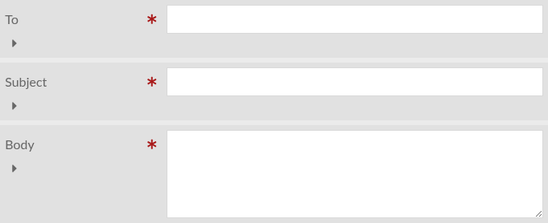
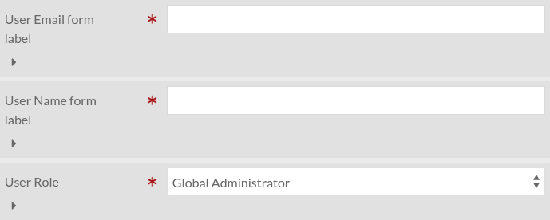

Form actions
============

Send an email
-------------

Send an email.

All settings can contain special tokens that will be replaced by data from the
form submission.

For instance, if the form contains a text input named ``email``, you can set
the "To" parameter to ``{email}`` to send an email to the user that submitted
the form.

Additionally, if the submission is linked to a resource (eg. created from a
resource page block), you can use the following tokens:

================================ ==============================================
Token                            Replaced by
================================ ==============================================
``{formularium:resource:id}``    Resource's internal id
``{formularium:resource:url}``   Resource's URL
``{formularium:resource:title}`` Resource's title (which is the title according
                                 to the resource template, not necessarily
                                 ``dcterms:title``)
``{formularium:resource:type}``  Resource's type ("item", "item set", or
                                 "media")
================================ ==============================================

Settings
________

To
    The e-mail recipient

Subject
    The e-mail subject

Body
    The e-mail body

Create a user
-------------

Create a user from an email and a username.

The settings allow you to select the role of the created user and its groups.

Settings
________

Username
    The HTML element name of the form component containing the username.

Email
    The HTML element name of the form component containing the username.

Role
    The role of the created user.

Groups (only if the module Groups is installed)
    The groups the user is in.
