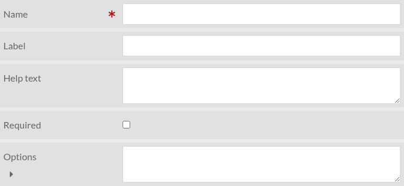
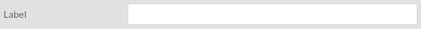

Form components
===============

Form components are the building blocks of a form. Several types of component
exist. Most types share the following subset of parameters:

Name
    This should be a unique identifier of the form component. It will be used
    as the HTML element's ``name`` attribute value.

Label
    The text that will be displayed in front of the form element

Help text
    A more detailed description of the form element and what is expected from
    the user. It should be displayed next to the label, but depending on the
    theme used it could be different.

Required
    Required form components prevent the form to be submitted if they are empty
    (not set).

For parameters specific to a form component type, see below.

Checkbox
--------

A simple checkbox that is unchecked by default.

Settings
________

.. image:: images/form-component/checkbox.png

Dropdown list
-------------

A dropdown list, whose options can be set manually or be retrieved from a "Custom Vocab" vocabulary

Settings
________

Options
    A list of options, one per line

Custom Vocab
    This parameter is visible only if Custom Vocab module is enabled. If set,
    the "Options" parameter is ignored.

File upload
-----------

Allow user to upload files

Settings
________

.. image:: images/form-component/file_input.png

Accepted file types
    A comma-separated list of accepted file types. If empty, all file types are accepted.

Accepted file extensions
    A comma-separated list of accepted file extensions. If empty, all file extensions are accepted.

Maximum file size
    Maximum file size in bytes or in SI notation. For instance "10485760" or "10MB".

HTML
----

This component type allow to add arbitrary HTML in the form

Settings
________

.. image:: images/form-component/html.png

HTML
    The HTML code to be added to the form. A WYSIWYG editor is available.

Recaptcha (antispam)
--------------------

Prevent spam with reCAPTCHA (Google). Requires "reCAPTCHA site key" and
"reCAPTCHA secret key" to be set (see `security settings
<https://omeka.org/s/docs/user-manual/admin/settings/#security>`__)

Settings
________

Text area
---------

A multi-line text input

Settings
________

.. image:: images/form-component/textarea.png

Text input
----------

A simple text input

Settings
________

.. image:: images/form-component/text_input.png

User e-mail address
-------------------

This is like "Text input" but is automatically set to user's email if user is
authenticated.

Settings
________

.. image:: images/form-component/user_email.png
