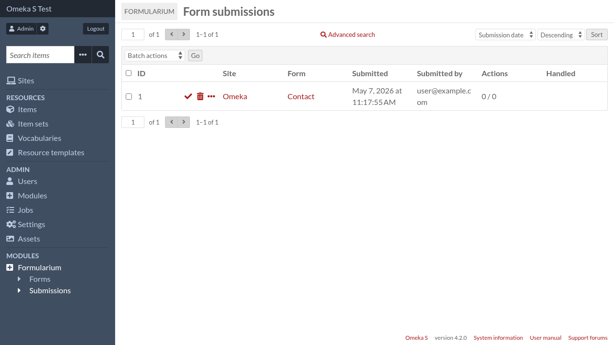
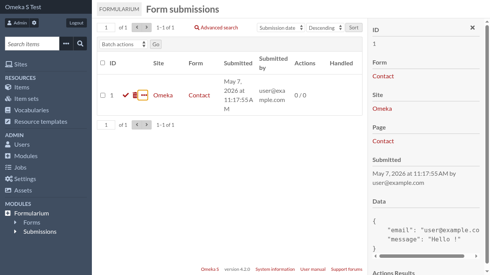

Form submissions
================

To view form submissions, go to the admin interface and click on "Formularium"
in the navigation menu, and then on "Form submissions" (in the navigation menu
too).

You can see how many of actions actions succeeded over the total number of action.

Details of each submission can be viewed by clicking on the "details" link (the
three horizontal dots). 

In the details each action show their status and can display more information in json form about their execution.

Submissions can be marked as handled and deleted, one by one or by batch.
